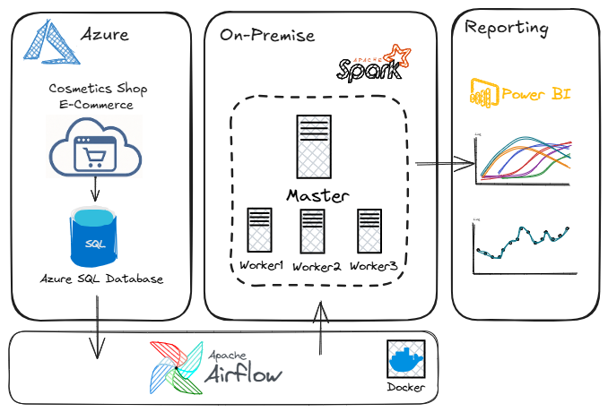

# DataEnginner-ApacheSpark

<!DOCTYPE html>
<html lang="es">

<body>
           <blockquote>
            Este proyecto demuestra un pipeline completo de análisis de datos a gran escala, desde la ingesta y procesamiento con Apache Spark hasta la segmentación de clientes mediante K-Means. El objetivo es extraer insights valiosos sobre el comportamiento de los usuarios en una tienda de cosméticos online para impulsar decisiones de negocio.
        </blockquote>
        <h2 id="arquitectura-del-proyecto">Arquitectura del Proyecto</h2>
        

            Se ha diseñado una arquitectura robusta y escalable, típica de un entorno de producción de datos, que sirve como marco conceptual para este proyecto.
        

               
        <h4>Flujo de Datos:</h4>
        <ol>
            <li><strong>Fuente de Datos (Azure):</strong> Los eventos de la tienda de e-commerce se capturan y almacenan en una <strong>Azure SQL Database</strong>, actuando como nuestro sistema transaccional (OLTP).</li>
            <li><strong>Orquestación (Apache Airflow):</strong> Un DAG de <strong>Apache Airflow</strong> se encarga de orquestar el pipeline, extrayendo datos periódicamente desde Azure SQL para su procesamiento.</li>
            <li><strong>Procesamiento Distribuido (On-Premise con Spark):</strong> Los datos son procesados en un clúster <strong>Apache Spark</strong> . Aquí se realizan las tareas de limpieza, transformación (ETL), análisis exploratorio, ingeniería de características y modelado de machine learning.</li>
            <li><strong>Reporting y Visualización (Power BI):</strong> Los datos procesados y los resultados del análisis (como los segmentos de clientes) se cargan en una herramienta de BI como <strong>Power BI</strong> para crear dashboards interactivos y reportes para los stakeholders.</li>
        </ol>
        

            <strong>Nota:</strong> El notebook <code>ApacheSpark_CosmeticsECommerce.ipynb</code> incluido en este repositorio es una implementación práctica y detallada de la lógica de procesamiento (Paso 3) en un entorno de Google Colab. Demuestra el código y la metodología utilizados en el motor de Spark para transformar los datos crudos en insights accionables.
       
     
        <h2 id="tecnologias-utilizadas">Tecnologías Utilizadas</h2>
        <ul>
            <li><strong>Procesamiento de Datos:</strong> Apache Spark 3.4.3, PySpark</li>
            <li><strong>Lenguaje y Librerías:</strong> Python, Pandas, Matplotlib, Seaborn, KaggleHub</li>
            <li><strong>Entorno de Desarrollo:</strong> Google Colab</li>
            <li><strong>Arquitectura Conceptual:</strong> Microsoft Azure (SQL Database), Apache Airflow, Docker, Power BI</li>
        </ul>
        <h2 id="fases-del-proyecto">Fases del Proyecto</h2>
        
El notebook está estructurado para seguir un flujo de trabajo de análisis de datos de principio a fin:

        <ol>
            <li><strong>Configuración del Entorno:</strong> Instalación de Java 8 y Apache Spark en el entorno de Colab. Creación de una <code>SparkSession</code> optimizada para el manejo de grandes volúmenes de datos.</li>
            <li><strong>Ingesta de Datos:</strong> Descarga automatizada del dataset de Kaggle (<em>E-Commerce Events History in Cosmetics Shop</em>) URL:https://www.kaggle.com/datasets/mkechinov/ecommerce-events-history-in-cosmetics-shop y carga en un DataFrame de Spark.</li>
            <li><strong>Limpieza y Preparación:</strong> Tratamiento de valores nulos (rellenando con 'unknown' o eliminando filas críticas), conversión de tipos de datos (ej. String a Timestamp) y eliminación de duplicados para asegurar la calidad de los datos.</li>
            <li><strong>Análisis Exploratorio de Datos (EDA):</strong> Investigación inicial para entender la distribución de eventos (vistas, carritos, compras), las marcas y categorías más populares, y los patrones temporales de actividad (por hora y día de la semana). Se calculó un embudo de conversión para medir la eficiencia del proceso de compra.</li>
            <li><strong>Ingeniería de Características:</strong> Creación de nuevas variables para enriquecer el dataset de cara al modelado. Se generaron características a nivel de sesión (ej. duración, eventos por sesión) y a nivel de usuario (ej. gasto total, número de sesiones, productos únicos vistos).</li>
            <li><strong>Análisis Avanzado (Machine Learning):</strong> Implementación de un modelo de clustering <strong>K-Means</strong> para la segmentación de clientes. Se utilizó el método del Coeficiente de Silueta para determinar el número óptimo de clusters y se interpretaron los segmentos resultantes.</li>
        </ol>
        <h2 id="resultados-clave-y-visualizaciones">Resultados Clave y Visualizaciones</h2>
        
El análisis arrojó insights significativos sobre los patrones de compra y los tipos de clientes.

        <h4>Embudo de Conversión:</h4>
        <ul>
            <li>Tasa de conversión de <strong>Vista a Carrito: 58.50%</strong></li>
            <li>Tasa de conversión de <strong>Carrito a Compra: 22.76%</strong></li>
        </ul>
        
Esto indica una buena capacidad para atraer el interés inicial, pero existe una oportunidad importante para optimizar el cierre de la venta una vez que los productos están en el carrito.

        <h4>Segmentación de Clientes:</h4>
        
Mediante K-Means, se identificaron <strong>3 segmentos de clientes</strong> con comportamientos muy diferenciados:

        <ul>
            <li><strong>Segmento 0 (Clientes Ocasionales):</strong> Constituyen la gran mayoría de los usuarios. Tienen muy pocas sesiones, un bajo número de interacciones y un gasto casi nulo. Representan a visitantes esporádicos o nuevos usuarios.</li>
            <li><strong>Segmento 2 (Clientes Comprometidos):</strong> Un grupo de tamaño medio con un nivel de actividad moderado. Realizan más compras y gastan más que los ocasionales, mostrando un interés recurrente.</li>
            <li><strong>Segmento 1 (Clientes de Alto Valor / "Power Users"):</strong> Aunque es el grupo más pequeño, su valor es desproporcionadamente alto. Tienen un número muy elevado de sesiones, interacciones, compras y un gasto total significativamente superior al resto. Son los clientes más leales y valiosos.</li>
        </ul>
        <h2 id="como-ejecutar-el-notebook">Cómo Ejecutar el Notebook</h2>
        <ol>
            <li>Clona este repositorio en tu máquina local.</li>
            <li>Abre .</li>
            <li>Haz clic en <code>Archivo > Subir notebook</code> y selecciona el archivo <code>ApacheSpark_CosmeticsECommerce.ipynb</code>.</li>
            <li>Ejecuta las celdas en orden. El notebook está diseñado para instalar todas las dependencias y descargar el dataset automáticamente.</li>
        </ol>
        <h2 id="conclusiones-y-proximos-pasos">Conclusiones y Próximos Pasos</h2>
        
Este proyecto demuestra con éxito cómo Apache Spark puede ser utilizado para procesar y analizar grandes volúmenes de datos de e-commerce, generando insights accionables como la segmentación de clientes.

        <h4>Acciones de Negocio Sugeridas:</h4>
        <ul>
            <li><strong>Marketing Dirigido:</strong> Crear campañas específicas para cada segmento. Por ejemplo, programas de lealtad para los "Power Users", campañas de reactivación para los "Clientes Comprometidos" y ofertas de bienvenida para los "Ocasionales".</li>
            <li><strong>Optimización de la Conversión:</strong> Analizar el abandono del carrito y desarrollar estrategias (ej. recordatorios por email, ofertas de último minuto) para mejorar la tasa de conversión del 22.76%.</li>
        </ul>
        <h4>Mejoras Futuras:</h4>
        <ul>
            <li><strong>Análisis de Churn:</strong> Desarrollar un modelo predictivo para identificar clientes en riesgo de abandono.</li>
            <li><strong>Sistema de Recomendación:</strong> Implementar un motor de recomendaciones de productos basado en el historial de vistas y compras.</li>
            <li><strong>Implementación en Cloud:</strong> Desplegar este pipeline en un entorno cloud real (ej. Azure Databricks o AWS EMR) utilizando la arquitectura propuesta.</li>
        </ul>
    

</body>
</html>
